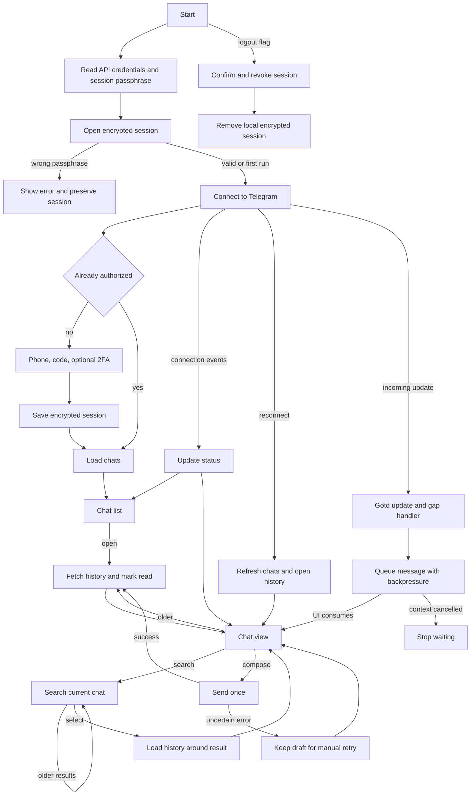

# Telegram client flow

```mermaid
flowchart TD
    A[Start] --> B[Read API credentials and session passphrase]
    B --> C[Open encrypted session]
    C -->|wrong passphrase| X[Show error and preserve session]
    C -->|valid or first run| D[Connect to Telegram]
    D --> E{Already authorized}
    E -->|no| F[Phone, code, optional 2FA]
    F --> G[Save encrypted session]
    E -->|yes| H[Load chats]
    G --> H
    H --> I[Chat list]
    I -->|open| J[Fetch history and mark read]
    J --> K[Chat view]
    K -->|older| J
    K -->|search| L[Search current chat]
    L -->|older results| L
    L -->|select| P[Load history around result]
    P --> K
    K -->|compose| M[Send once]
    M -->|success| J
    M -->|uncertain error| N[Keep draft for manual retry]
    N --> K
    D -->|connection events| O[Update status]
    O --> I
    O --> K
    D -->|reconnect| Q[Refresh chats and open history]
    Q --> K
    D -->|incoming update| U[Gotd update and gap handler]
    U --> V[Queue message with backpressure]
    V -->|UI consumes| K
    V -->|context cancelled| T[Stop waiting]
    A -->|logout flag| R[Confirm and revoke session]
    R --> S[Remove local encrypted session]
```
