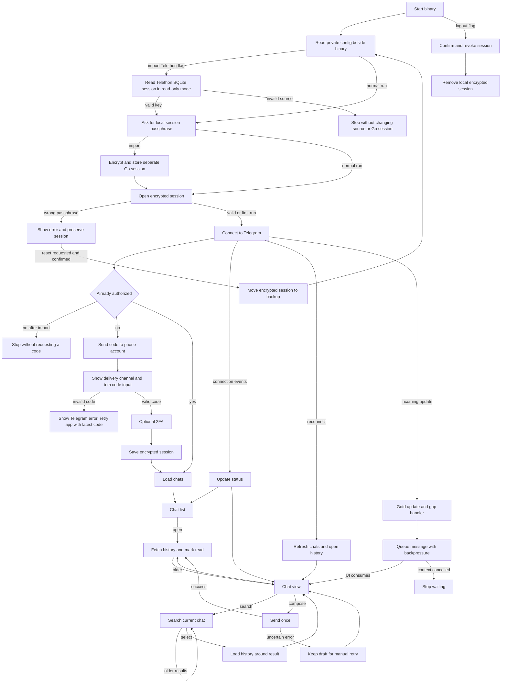

# Telegram client flow

```mermaid
flowchart TD
    A[Start binary] --> B[Read private config beside binary]
    B -->|import Telethon flag| TI[Read Telethon SQLite session in read-only mode]
    TI -->|valid key| BP[Ask for local session passphrase]
    TI -->|invalid source| TE[Stop without changing source or Go session]
    B -->|normal run| BP
    BP -->|import| TB[Encrypt and store separate Go session]
    TB --> C[Open encrypted session]
    BP -->|normal run| C
    C -->|wrong passphrase| X[Show error and preserve session]
    X -->|reset requested and confirmed| Y[Move encrypted session to backup]
    Y --> B
    C -->|valid or first run| D[Connect to Telegram]
    D --> E{Already authorized}
    E -->|no after import| IE[Stop without requesting a code]
    E -->|no| F[Send code to phone account]
    F --> FC[Show delivery channel and trim code input]
    FC -->|invalid code| FE[Show Telegram error; retry app with latest code]
    FC -->|valid code| FP[Optional 2FA]
    FP --> G[Save encrypted session]
    E -->|yes| H[Load chats]
    G --> H
    H --> I[Chat list]
    I -->|open| J[Fetch history and mark read]
    J --> K[Chat view]
    K -->|older| J
    K -->|search| L[Search current chat]
    L -->|older results| L
    L -->|select| P[Load history around result]
    P --> K
    K -->|compose| M[Send once]
    M -->|success| J
    M -->|uncertain error| N[Keep draft for manual retry]
    N --> K
    D -->|connection events| O[Update status]
    O --> I
    O --> K
    D -->|reconnect| Q[Refresh chats and open history]
    Q --> K
    D -->|incoming update| U[Gotd update and gap handler]
    U --> V[Queue message with backpressure]
    V -->|UI consumes| K
    V -->|context cancelled| T[Stop waiting]
    A -->|logout flag| R[Confirm and revoke session]
    R --> S[Remove local encrypted session]
```
